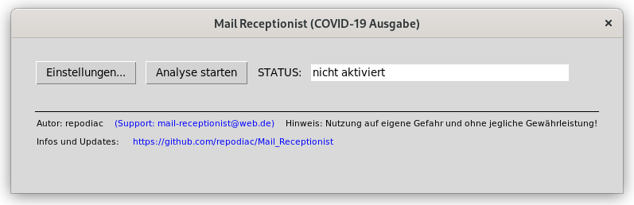

# Mail Receptionist (COVID-19 Ausgabe)

<span style="color:red">***IMPORTANT NOTE: This project is currently available in German, only - in case, you are interested in an English or international version, let me know in the Issues section***</span>.



**Mail Receptionist (COVID-19 Ausgabe)** ist ein pythonbasiertes Analyse-Tool mit graphischer Benutzeroberfläche (GUI), welches Ihre eMail-Anfragen bzgl. einer COVID-19 Impfung vollautomatisch ein- bzw. aussortiert und auf Wunsch zusätzlich automatisch eine Antwort an den Absender sendet. So bleibt Ihnen mehr Zeit für Ihre Patienten oder die Anstellung von Extra-Mitarbeitern zur Bewältigung der aktuellen Mailflut entfällt.

Alle Analysen und Datenverarbeitungen werden ausschließlich auf Ihrem lokalen Rechner durchgeführt (analog zu einem regulären Mail Client), zusätzlich wurde darauf geachtet, nur verschlüsselte eMail-Kommunikation zuzulassen. Somit sollte dies datenschutzrechtlich unbedenklich sein. 

Die Analyse kategorisiert bzw. klassifiziert  mittels Machine Learning alle eingehenden Mails automatisch in einem festgelegten Interval, um diese bei positiver Klassifikation in spezielle Ordner auf dem eMail-Server zu verschieben oder mit einem Tag (analog zu "[SPAM]") im Betreff zu versehen. Diese Mails können dann bei Bedarf nachträglich auch manuell gelöscht oder archiviert werden (z.B. auch mittels regulärer eMail-Filter wie bei Outlook oder Thunderbird üblich).

## Lizenz und Zitierungen

This work is licensed under the Creative Commons Attribution 4.0 International License. To view a copy of this license, visit http://creativecommons.org/licenses/by/4.0/ or send a letter to Creative Commons, PO Box 1866, Mountain View, CA 94042, USA.

To provide **attribution or cite this work** please use the following text snippet:
```
Mail_Receptionist, Copyright 2021 by repodiac, see https://github.com/repodiac for updates and further information
```

## Versionsgeschichte

* `0.1.2` - Windows Release mit all-in-one Executable, [hier ZIP runterladen](https://github.com/repodiac/Mail_Receptionist/releases/tag/0.1.2)
* `soft release 0.1.1` - GUI bugfix, erste Hinweise für das Setup unter Windows
* `soft release 0.1` - erstes Soft-Release, Dokumentation und Windows-Installation etc. fehlen noch

# Installation/Setup

## Ausführbare, All-In-One Installation (Windows)

Über den Punkt _Releases_ in Github (rechte Seitenleiste) gelangt man zu einem [ZIP-Archiv](https://github.com/repodiac/Mail_Receptionist/releases/tag/0.1.2), welches nur entpackt werden muss unter Windows.
Alle externen Bibliotheken sowie [Universal Sentence Encoder Multilingual](https://tfhub.dev/google/universal-sentence-encoder-multilingual/3) (Lizenz: Apache 2.0)
sind bereits integriert, es muss **nichts mehr sonst heruntergeladen werden**.

Es kann dann z.B. eine Desktop-Verknüpfung von `mail_receptionist.exe` angefertigt werden oder per Doppelklick das Programm direkt gestartet werden.

## Reine Python-Installation

### Abhängigkeiten (Linux/Windows):

```
* Python 3.6.x (getestet mit Version 3.6.12 unter Linux und 3.6.8 unter Windows 7)
* Für den Download ggf. GIT oder Git for Windows
* Universal Sentence Encoder Multilingual (Lizenz: Apache 2.0)
* Externe Bibliotheken: pip install -r requirements.txt
```
**Wichtiger Hinweis für Windows**

Ggf. gibt es beim Start einen Fehler mit u.a. dem Hinweis: `Failed to load the native Tensorflow runtime.`

Hier hilft es wenn die **neueste** Version der *[Microsoft Visual C++ Redistributable for Visual Studio 2015, 2017 and 2019](https://support.microsoft.com/en-us/topic/the-latest-supported-visual-c-downloads-2647da03-1eea-4433-9aff-95f26a218cc0)*
heruntergeladen und installiert wird.

## In 3 Schritten zu Installation und Start (Linux/Windows)

1. Download und Bibliotheken installieren
```
git clone https://github.com/repodiac/Mail_Receptionist.git 
cd Mail_Receptionist
pip install -r requirements.txt
```
**Hinweis für Windows**:
Bei Git for Windows gibt es ggf. keine Unterstützung für HTTPS, dann bitte mit HTTP probieren: 
`git clone http://github.com/repodiac/Mail_Receptionist.git `

2. Universal Sentence Encoder downloaden und entpacken

* Download von [Universal Sentence Encoder, Version 3](https://tfhub.dev/google/universal-sentence-encoder-multilingual/3?tf-hub-format=compressed)
* Dann entpacken und das Verzeichnis in das Projektverzeichnis verschieben, also nach Verzeichnis `[..]/Mail_Receptionist/universal-sentence-encoder-multilingual_3`

3. Start von Mail Receptionist
```
python mail_receptionist.py
```
